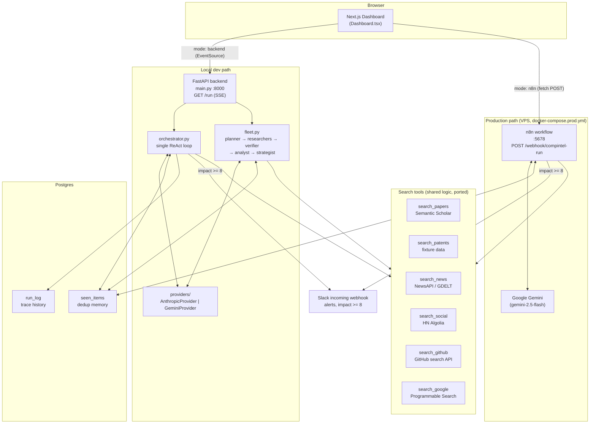
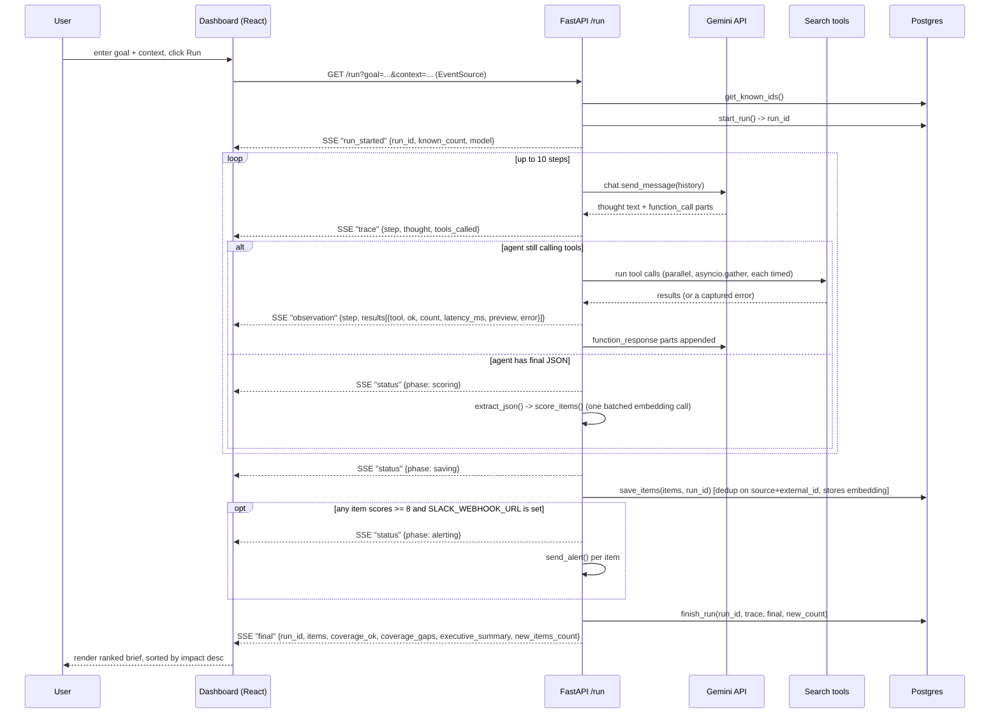
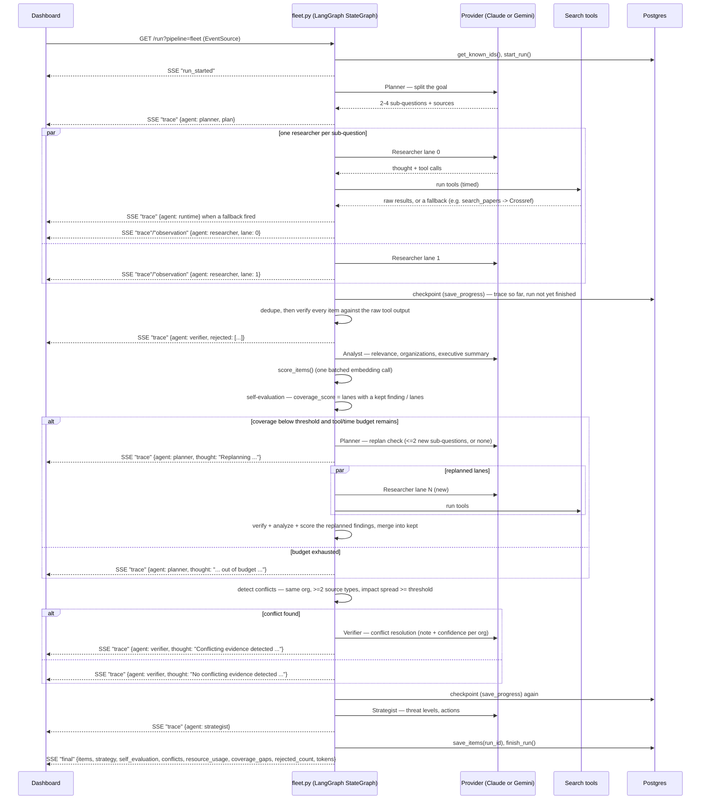
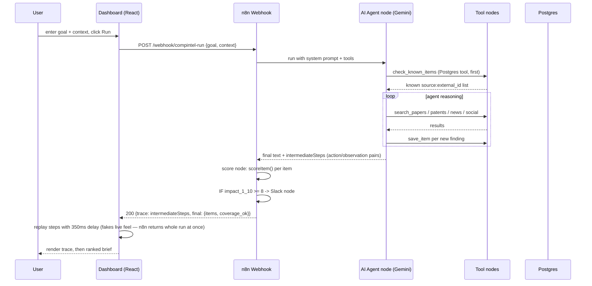
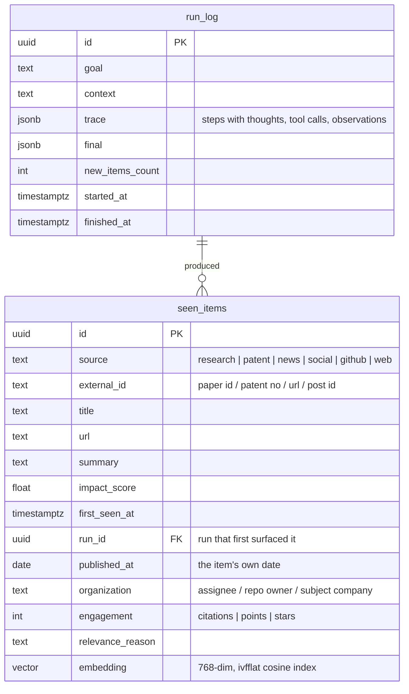
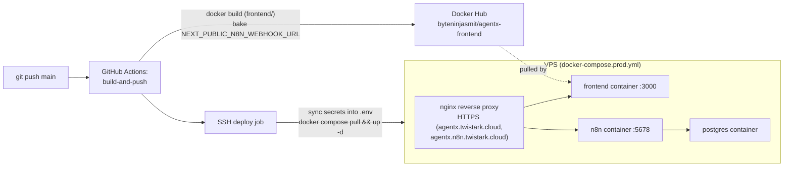
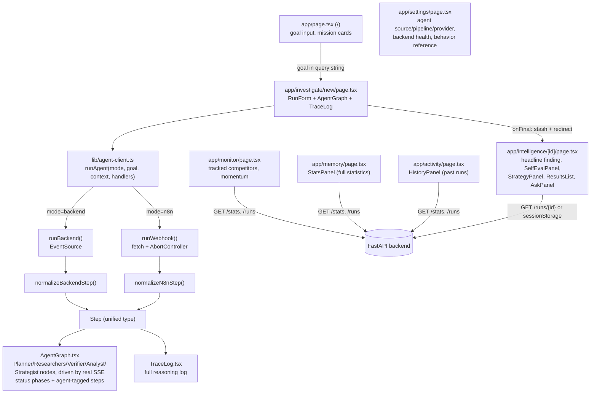

# Architecture

AgentX has **two implementations of the agent** sharing one frontend and one
Postgres schema:

- **Python backend** (`backend/`) — FastAPI, provider-agnostic (Anthropic Claude or
  Google Gemini, chosen per run). Streams over Server-Sent Events. Two pipelines:
  **`fleet`** (Planner → parallel Researchers → Verifier → Analyst → Strategist,
  orchestrated as a [LangGraph](https://github.com/langchain-ai/langgraph)
  `StateGraph` — see "Why LangGraph" below) and **`single`** (the original one-agent
  ReAct loop), both emitting identical event shapes so the frontend does not need to
  know which ran.
- **n8n workflow** (`n8n/WORKFLOW.md`) — n8n + Google Gemini, used in the deployed
  environment (`docker-compose.prod.yml`). **Two agents with a real handoff**:
  a Research agent gathers, an Analyst agent judges, dedups, and summarizes.

`backend/agent/providers/` holds the provider protocol and its two implementations;
nothing else in the agent imports a vendor SDK. Claude has no embedding model, so
`AnthropicProvider.embed` delegates to Gemini — deliberately, so that vectors written
by a Claude run and a Gemini run stay comparable inside the same pgvector column.

The frontend (`frontend/`) can talk to either — a source toggle in the dashboard
picks which one a run uses (see `frontend/lib/agent-client.ts`).

## Component diagram (both environments)



## Request sequence — local backend (SSE)

Events are emitted **as they happen**. `run_agent_stream()` is an async generator and
`main.py` forwards each event straight to the client, so the thought for a step
reaches the browser before its tools have finished running.



## Why LangGraph

`backend/agent/fleet.py`'s pipeline is not deterministic — how many researchers run
depends on what the Planner decides, whether a replanning round happens depends on
evidence the Verifier and Analyst haven't produced yet, and the Researcher fan-out
count changes again if it does. That is a genuine excuse to reach for an agent
framework rather than a linear script, so the fleet is built as a LangGraph
`StateGraph` (`_build_graph()` in `fleet.py`):

- **Dynamic fan-out** — `add_conditional_edges("plan", _fan_out_research, ...)`
  returns one `Send("research", {...})` per sub-question the Planner actually
  produced (2-4 normally, however many `_replan_check` adds on a replanning round).
  LangGraph runs them concurrently and waits at the next fixed edge (`research ->
  verify`) for all of them — the map-reduce barrier that used to be
  `asyncio.gather(...)`.
- **Conditional routing, not an if/elif chain** — `self_eval -> {replan_check,
  conflict_check}` is a real conditional edge reading `coverage_score`,
  `coverage_gaps` and the resource budget out of graph state; `replan_check ->
  {research_replan fan-out, conflict_check}` reads the planner's own decision the
  same way.
- **Shared state, not closures** — `FleetState` (a `TypedDict`) is the single
  source of truth every node reads and writes; list/counter fields
  (`raw_items`, `coverage_gaps`, `tool_calls_used`, `tokens_input`, ...) are
  `Annotated` with a reducer so parallel Researcher nodes merge into it safely
  instead of racing.
- **The trace stream is unchanged** — every node calls `get_stream_writer()` and
  pushes the exact `{"kind": "trace"/"status"/"checkpoint", ...}` shapes
  `run_fleet_stream` used to build inline; the outer function now just consumes
  `graph.astream(state, stream_mode=["custom", "values"])` and turns `"custom"`
  chunks into the same SSE events the frontend already renders, with the final
  `"values"` chunk (the completed graph state) building the `final` result. Nothing
  outside `fleet.py` — not `main.py`, not the frontend — had to change.

Verified against the offline harness (`_build_graph()` run start-to-finish with a
faked provider/tools/memory, no network or DB) and against the real Gemini provider
and real tool APIs with only the Postgres calls stubbed — both exercise the
fallback, replanning, self-evaluation and conflict-resolution paths through the
compiled graph.

## Request sequence — the specialist fleet



A researcher that raises is recorded as a coverage gap and the run continues — one
dead lane must not take the brief down with it. Replanning is capped at one round by
construction (not a token budget), and both the resource-budget check and the
conflict-resolution call are skipped entirely on the happy path — they only run, and
only cost anything, when the coverage/conflict conditions above actually hold.

### Autonomous fleet behaviors

These are implemented in `backend/agent/fleet.py`, tunable via environment variables,
and covered by an offline test harness (a fully faked provider/tools/memory) that
forces a fallback, a thin lane, and a cross-source conflict in one run to prove all
three fire correctly with no network or database involved:

| Behavior | Trigger | Env var (default) |
|---|---|---|
| Dynamic replanning | `coverage_score < threshold` or any coverage gap | `FLEET_COVERAGE_THRESHOLD` (0.7), `FLEET_MAX_REPLAN_QUESTIONS` (2) |
| Tool fallback | `search_papers` primary source errors | — (Crossref, no key required) |
| Evidence conflict resolution | same org, ≥2 source types, impact spread ≥ threshold | `FLEET_CONFLICT_SPREAD` (3.5) |
| Resource-aware execution | replan would be attempted but the budget is spent | `FLEET_MAX_TOOL_CALLS` (60), `FLEET_TIME_BUDGET_SECONDS` (180) |
| Mid-run checkpointing | after the research round, and again after conflict resolution | — (`memory.save_progress`, best-effort) |

`final.self_evaluation` (`coverage_score`, `threshold`, `replanned`, `replan_rationale`),
`final.conflicts` (per-organization note + confidence), and `final.resource_usage`
(tool calls and elapsed time spent) carry all of this into the stored run and the
`SelfEvalPanel` on the intelligence report — nothing above is trace-only.

## Request sequence — n8n webhook (production)



## Data model



`seen_items` has a unique constraint on `(source, external_id)` — this is the dedup
mechanism: a repeat run with the same goal only reports items not already in this
table (`ON CONFLICT DO NOTHING` on insert, `get_known_ids()`/`check_known_items`
tool on read).

The row is opened by `start_run()` before the agent begins, so items can reference
their run and the dashboard receives a `run_id` at the start of the stream;
`finish_run()` fills in the trace, final payload, and `finished_at`.

The `embedding` column stores the vector `scoring.py` already computes for relevance
instead of discarding it — that is what the planned Q&A retrieval, related-item
lookup, novelty score, and topic clustering read from. It requires the `vector`
extension, which is why both compose files use the `pgvector/pgvector:pg16` image
rather than plain `postgres:16`.

## Scoring formula

```
score = 10 * (0.30 * source_authority + 0.25 * recency + 0.30 * relevance + 0.15 * velocity)
```

- `source_authority` — fixed per source: research 0.9, patent 0.8, github 0.6,
  news 0.5, web 0.4, social 0.3
- `recency` — `exp(-days_old / 14)`, half-life about 10 days
- `relevance` — **cosine similarity** between the item's embedding and the project
  context's embedding (`gemini-embedding-001`, pinned to 768 dimensions), computed
  in one batched call for the context plus every item
- `velocity` — `log1p(engagement) / log1p(scale)`, capped, where `scale` is the
  per-source count that counts as strong traction (research 50, social 200,
  news 100, patent 10, github 500). Sources with no engagement number score a
  neutral 0.5 rather than a fabricated one.

The Python path runs this in `backend/agent/scoring.py`. The n8n path runs the same
weights inline in its `Score Items` Code node.

## Deployment (production)



## Statistics and Q&A

`backend/agent/stats.py` computes every figure in SQL over `seen_items` and
`run_log` — nothing is modelled or asked of an LLM. Per-tool reliability is read
back out of the stored traces (`jsonb_array_elements` over each step's
`observations`), which is what distinguishes a one-off coverage gap from a source
that is permanently down. Novelty is the cosine distance from an item to its
nearest older neighbour.

`backend/agent/qa.py` answers questions over the same rows. Retrieval is hybrid —
Postgres `ts_rank` full text (good at exact names and acronyms) and pgvector cosine
(good at paraphrase), combined by reciprocal rank fusion with k=60. The answering
prompt is cite-or-refuse: a claim with no `[n]` behind it is treated as a bug, and
"the corpus does not contain this" is a valid answer.

## Evaluation

`backend/evaluation/` is a deterministic benchmark harness — separate from
`stats.py`'s per-run telemetry — that runs the **real** `fleet.py` `StateGraph` and
`orchestrator.py` loop against **scripted** providers and tools instead of live
models/APIs/Postgres, so the framework mechanics (verification, coverage self-eval,
replanning, tool-fallback recovery, conflict detection, cite-or-refuse) get checked
on fixed, repeatable cases rather than eyeballed.

- `datasets.py` / `case_builders.py` — 53 cases across 7 categories: `normal`,
  `tool_failure`, `contradictory`, `incomplete`, `adversarial`, `replanning` (a
  Ladder-5-mechanics category added beyond the original roadmap sketch), and
  `ambiguous`. Each `Case` is Python data (not JSON — several cases need to express
  "this tool call raises," which JSON has no clean way to say); `case_builders.py`
  holds one factory function per category so authoring a new case only needs the
  domain-specific content (goal, context, orgs, titles, urls), not the
  planner/analyst/verifier script wiring. One case (`normal-001`) also carries a
  `pipeline=single` script, so it runs as a `fleet` vs `single` baseline pair.
- `fakes.py` — `FakeProvider` routes `complete()`/`start()` calls to the right
  script by matching the distinctive phrase in each system prompt (`PLANNER_SYSTEM`,
  `RESEARCHER_SYSTEM`, ... in `fleet.py`), so no mock is needed per call site. Fake
  tools are built from the same case data and patched into `agent.runtime.TOOL_MAP`.
  `agent.fleet`/`agent.orchestrator`'s `get_known_ids`/`start_run`/`save_progress`/
  `save_items`/`finish_run` are patched to no-ops, so no `DATABASE_URL` is needed.
- `evaluators.py` — code-only, no LLM judge: task success (expected items kept),
  hallucination rejection (a planted ungrounded item must be in the verifier's
  `rejected` list, not the final output), recovery (a forced tool exception still
  yields a usable final result with the gap named), conflict detection (a same-org,
  cross-source impact disagreement gets flagged and resolved), replanning
  (thin initial coverage triggers exactly the bounded follow-up round `fleet.py`
  promises), and refusal (genuinely absent evidence yields empty items and
  `coverage_ok: false`, never a fabricated conclusion).
- `runner.py` / `metrics.py` / `report.py` — `python -m evaluation.runner
  [--pipeline fleet|single|both] [--repeat N] [--category ...] [--case ...]` runs the
  dataset, aggregates pass rate by category/check, reports repeat-to-repeat
  consistency, and exits non-zero on any failure (CI-usable as-is).

The dataset is now 53 cases across 7 categories (8 normal, 8 tool_failure, 8
contradictory, 8 incomplete, 8 adversarial, 6 replanning, 7 ambiguous) — inside the
40-60 case target ROADMAP.md § 8 set. `--pipeline both --repeat 3` (162 runs, 396
checks) passes 100% with 100% repeat-to-repeat consistency. There is still no
LLM-judge layer (only deterministic checks) and no human-eval step, and the
`pipeline=single` baseline script exists for only one case (`normal-001`) — those
remain the open items, not the dataset size.

## Frontend structure

The UI is routed, not a single-page dashboard — each surface below is its own
`app/**/page.tsx`, sharing `components/` and `lib/agent-client.ts`'s `runAgent()`.
Agent source (backend SSE vs. n8n), pipeline, and provider are chosen once on
`/settings` ("Agent Runtime") and persisted to `localStorage`
(`lib/run-settings.ts`), so every page that starts or reads a run agrees on them
without prop-drilling.



`components/charts/Charts.tsx` is hand-built inline SVG rather than a charting
library: the forms needed here are simple, and drawing them directly lets every
colour come from the themed custom properties in `globals.css`, so light and dark
are each a deliberately stepped palette instead of an automatic inversion. The
categorical slots are assigned in fixed order and never cycled, and were checked
against the lightness, chroma, CVD-separation and contrast gates in both modes.

`Step` carries two shapes of evidence because the two paths produce different
things: `observations` (backend — one structured record per tool call, with `ok`,
`count`, `latency_ms`, `preview`, `error`) and `observation` (n8n — one opaque
string per step). `TraceLog` renders the structured form as a collapsible
Thought -> Action -> Grounded Observation block and falls back to the string form.
