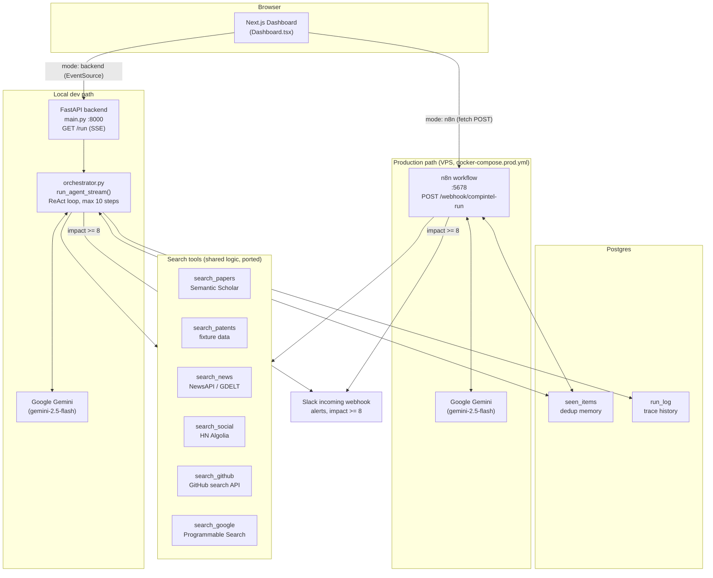
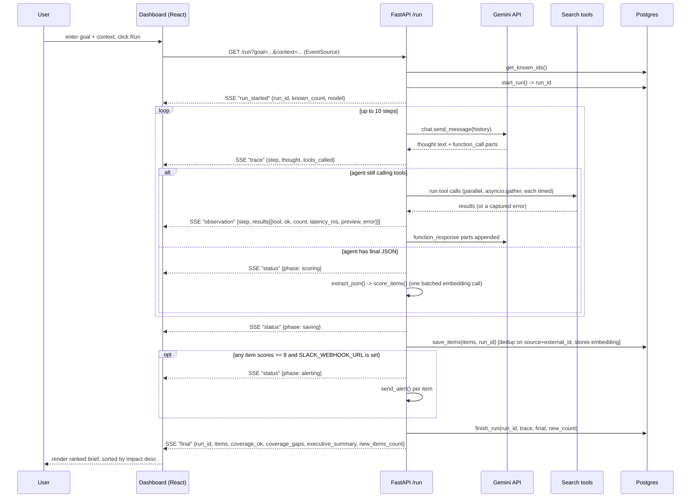
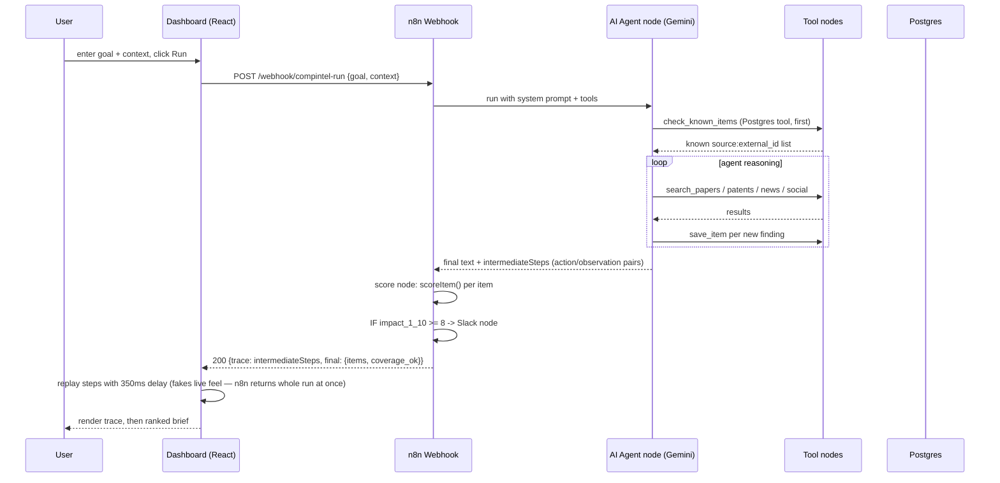
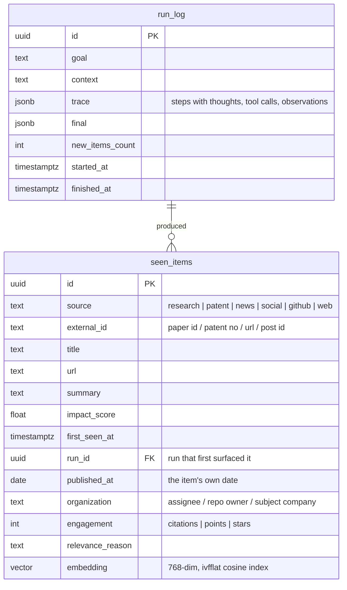
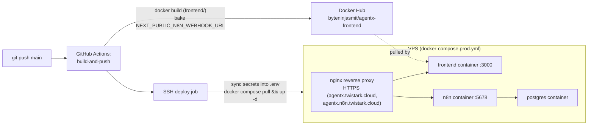
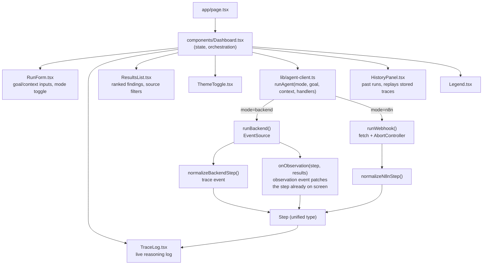

# Architecture

AgentX has **two implementations of the agent** sharing one frontend and one
Postgres schema:

- **Python backend** (`backend/`) — FastAPI + Google Gemini. Used for local dev.
  Streams over Server-Sent Events. **A single ReAct loop**: one agent plans, calls
  tools, and writes the final JSON, with `scoring.py` applying the impact formula
  afterwards.
- **n8n workflow** (`n8n/WORKFLOW.md`) — n8n + Google Gemini, used in the deployed
  environment (`docker-compose.prod.yml`). **Two agents with a real handoff**:
  a Research agent gathers, an Analyst agent judges, dedups, and summarizes.

The two are therefore not identical: the Research/Analyst split exists only in n8n.
Bringing the Python path up to a full specialist fleet is Phase 2b of
[ROADMAP.md](ROADMAP.md).

The frontend (`frontend/`) can talk to either — a source toggle in the dashboard
picks which one a run uses (see `frontend/lib/agent-client.ts`).

## Component diagram (both environments)



## Request sequence — local backend (SSE)

Events are emitted **as they happen**. `run_agent_stream()` is an async generator and
`main.py` forwards each event straight to the client, so the thought for a step
reaches the browser before its tools have finished running.



## Request sequence — n8n webhook (production)



## Data model



`seen_items` has a unique constraint on `(source, external_id)` — this is the dedup
mechanism: a repeat run with the same goal only reports items not already in this
table (`ON CONFLICT DO NOTHING` on insert, `get_known_ids()`/`check_known_items`
tool on read).

The row is opened by `start_run()` before the agent begins, so items can reference
their run and the dashboard receives a `run_id` at the start of the stream;
`finish_run()` fills in the trace, final payload, and `finished_at`.

The `embedding` column stores the vector `scoring.py` already computes for relevance
instead of discarding it — that is what the planned Q&A retrieval, related-item
lookup, novelty score, and topic clustering read from. It requires the `vector`
extension, which is why both compose files use the `pgvector/pgvector:pg16` image
rather than plain `postgres:16`.

## Scoring formula

```
score = 10 * (0.30 * source_authority + 0.25 * recency + 0.30 * relevance + 0.15 * velocity)
```

- `source_authority` — fixed per source: research 0.9, patent 0.8, github 0.6,
  news 0.5, web 0.4, social 0.3
- `recency` — `exp(-days_old / 14)`, half-life about 10 days
- `relevance` — **cosine similarity** between the item's embedding and the project
  context's embedding (`gemini-embedding-001`, pinned to 768 dimensions), computed
  in one batched call for the context plus every item
- `velocity` — `log1p(engagement) / log1p(scale)`, capped, where `scale` is the
  per-source count that counts as strong traction (research 50, social 200,
  news 100, patent 10, github 500). Sources with no engagement number score a
  neutral 0.5 rather than a fabricated one.

The Python path runs this in `backend/agent/scoring.py`. The n8n path runs the same
weights inline in its `Score Items` Code node.

## Deployment (production)



## Frontend structure



`Step` carries two shapes of evidence because the two paths produce different
things: `observations` (backend — one structured record per tool call, with `ok`,
`count`, `latency_ms`, `preview`, `error`) and `observation` (n8n — one opaque
string per step). `TraceLog` renders the structured form as a collapsible
Thought -> Action -> Grounded Observation block and falls back to the string form.
