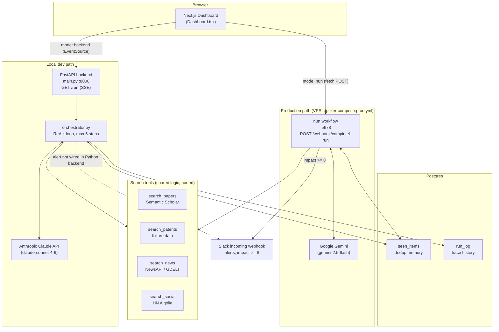
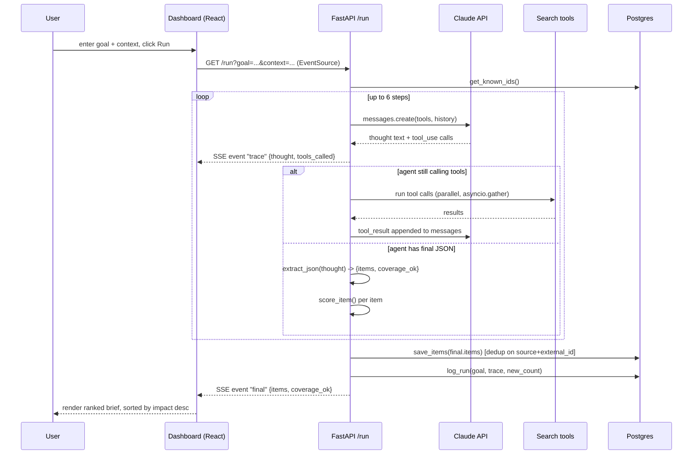
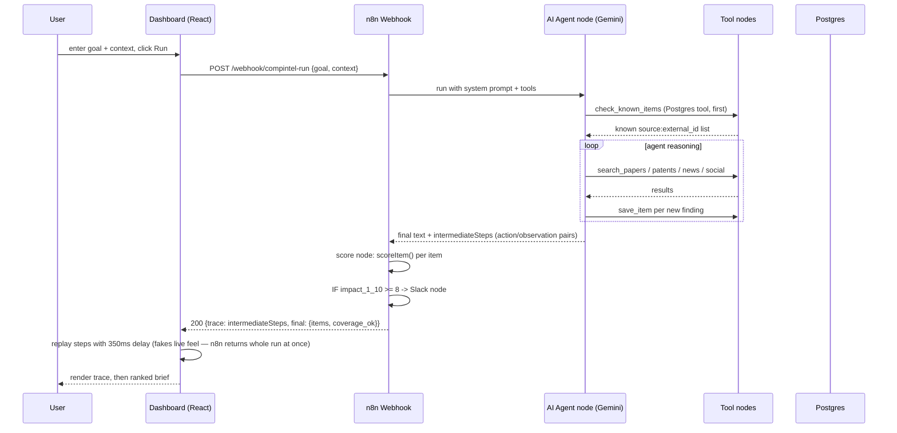
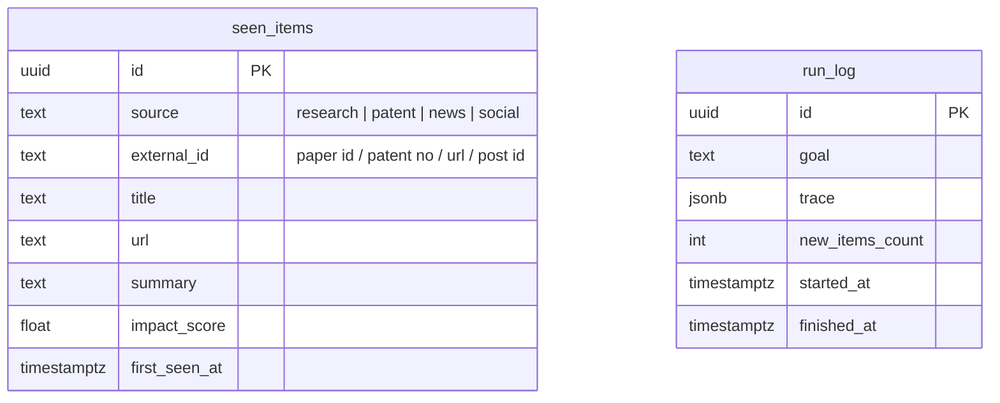
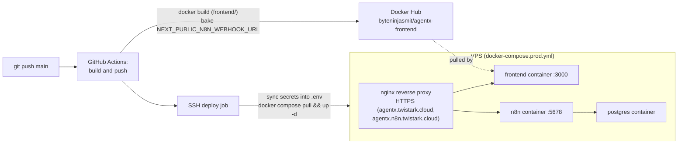
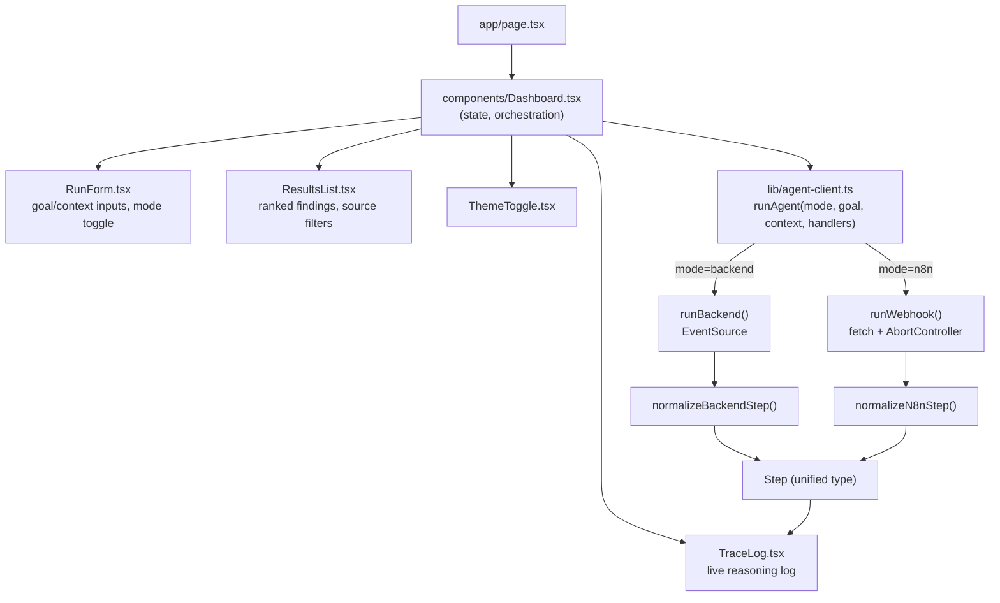

# Architecture

AgentX has **two parallel implementations of the same agent** sharing one frontend
and one Postgres schema:

- **Python backend** (`backend/`) — FastAPI + Anthropic Claude. Used for local dev.
  Streams via Server-Sent Events (SSE).
- **n8n workflow** (`n8n/WORKFLOW.md`) — same logic rebuilt visually with n8n +
  Google Gemini. Used in the deployed/production environment
  (`docker-compose.prod.yml`).

The frontend (`frontend/`) can talk to either — a source toggle in the dashboard
picks which one a run uses (see `frontend/lib/agent-client.ts`).

## Component diagram (both environments)



## Request sequence — local backend (SSE)



## Request sequence — n8n webhook (production)



## Data model



`seen_items` has a unique constraint on `(source, external_id)` — this is the dedup
mechanism: a repeat run with the same goal only reports items not already in this
table (`ON CONFLICT DO NOTHING` on insert, `get_known_ids()`/`check_known_items`
tool on read).

## Scoring formula

Both implementations run the identical weighted formula (Python: `scoring.py`,
n8n: inline Code node):

```
score = 10 * (0.30 * source_authority + 0.25 * recency + 0.30 * keyword_relevance + 0.15 * 0.5)
```

- `source_authority`: fixed per source — research 0.9, patent 0.8, news 0.5, social 0.3
- `recency`: `exp(-days_old / 14)` — exponential decay, half-life ~10 days
- `keyword_relevance`: overlap between item text and project context word sets

## Deployment (production)



## Frontend structure


